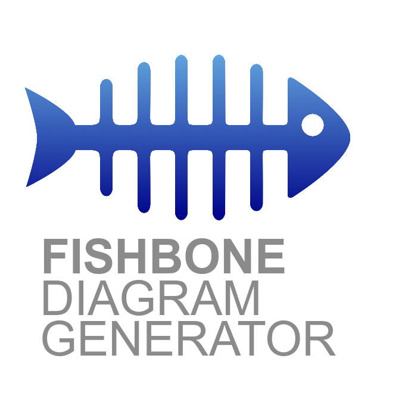
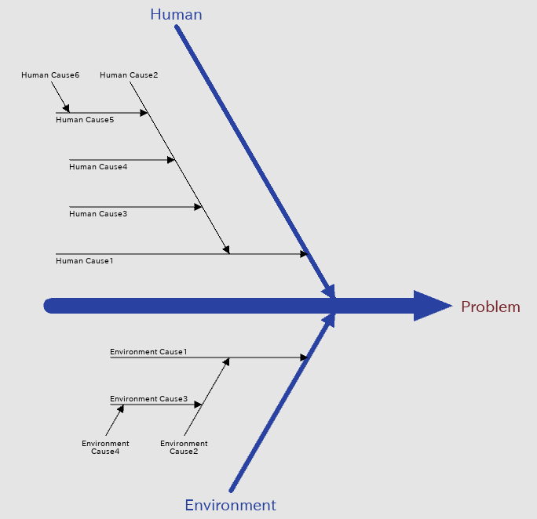

# Fishbone Diagram Generator
 
Fishbone Diagram Generator is a tool that can automatically generate Fishbone Diagram written in XML.

# DEMO
## XML Files
```xml
<?xml version="1.0" encoding="Shift_JIS"?>
<Diagram style = "fishbone">
    <Effect>Problem</Effect>
    <Factor text="Human">
        <Topics text="Human Cause1">
            <Topics text="Human Cause2">
                <Topics text="Human Cause3">
                </Topics>
                <Topics text="Human Cause4">
                </Topics>
                <Topics text="Human Cause5">
                    <Topics text="Human Cause6">
                    </Topics>
                </Topics>
            </Topics>
        </Topics>
    </Factor>
    <Factor text="Environment">
        <Topics text="Environment Cause1">
            <Topics text="Environment Cause2">
                <Topics text="Environment Cause3">
                    <Topics text="Environment Cause4">
                    </Topics>
                </Topics>
            </Topics>
        </Topics>
    </Factor>
</Diagram>
```
## Fishbone Diagram

 
# Features
* Supports automatic conversion to PNG files (* .png)
* Supports automatic conversion to PowerPoint files (* .pptx)
* Supports automatic conversion to SVG files (* .svg)

# Requirements
 
* python 3.9
* Kivy 2.0.0
* python-pptx 0.6.18
* svgwrite 1.4.1
* opencv-python 4.5.1.48
* ipaexg.ttf ([IPAex Gothic](https://moji.or.jp/ipafont/))

# Installation
 
```bash
python -m pip install --upgrade pip setuptools virtualenv
cd [Install Directory]
python -m virtualenv env
env\Scripts\activate
python -m pip install kivy[base] kivy_examples
python -m pip install python-pptx
python -m pip install svgwrite
python -m pip install opencv-python  
```
**Note:**  I recommend using virtualenv for Kivy.

[Kivy installation](https://kivy.org/doc/stable/gettingstarted/installation.html)

To support Japanese, download the [IPA font](https://moji.or.jp/ipafont/ipafontdownload/) and place the following files in the fonts folder.

```bash
.
├── fonts
|    └── ipaexg.ttf
└── README.md
```

# Usage

```bash
cd [Install Directory]
env\Scripts\activate
python main.py
```
1. Write the Fishbone Diagram in XML.

2. Click the  ('Open' button) to load the XML file.

3. Click the  ('Save' button) to export to PowerPoint file.


# Author
 
* goshawk111
 
# License
 
"Fishbone Diagram Generator" is under [MIT license](https://en.wikipedia.org/wiki/MIT_License).
 